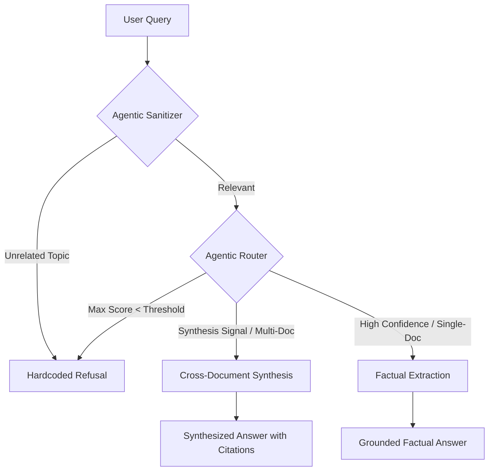

# Agentic RAG System for Global AI Regulation

This project implements a high-precision, **three-layer agentic Q&A system** designed to query and synthesize information across AI regulatory frameworks from the **EU, US, China, and UK**. 

Unlike standard RAG pipelines, this architecture incorporates a "reasoning-first" routing layer that utilizes **Agentic Sanitization** and **Confidence-Gap Analysis** to eliminate hallucinations and ensure grounded, cross-document synthesis.

---

## 🏗️ System Architecture

The system follows a modular, agentic workflow that prioritizes query understanding before retrieval or generation.



### 1. Ingestion Pipeline
- **Parsing**: Advanced extraction using `PyMuPDF` and `FastEmbed`.
- **Chunking**: Paragraph-aware splitting (400 token cap) ensures that legal clauses and semantic units are preserved.
- **Vector Store**: High-performance local indexing using `FAISS` and `BAAI/bge-small-en-v1.5` embeddings.

### 2. Multi-Stage Agentic Router
The router uses a "Defence-in-Depth" strategy to classify queries:
- **Layer 1: Similarity Gate**: Rejects queries with a maximum cosine similarity below `0.40`.
- **Layer 2: Agentic Sanitizer**: Queries with marginal confidence (0.40 - 0.65) are processed by a secondary `llama-3.1-8b` agent to verify domain relevance.
- **Layer 3: Confidence-Gap Analysis**: If multiple documents are retrieved but one is significantly more relevant than the others (score gap > `0.02`), the system defaults to a `Factual` route to prevent unnecessary noise in the answer.

### 3. Answer Generation
- **Factual Strategy**: Focused extraction from top-3 chunks.
- **Synthesis Strategy**: Multi-source reasoning across top-7 chunks with explicit **Contradiction Handling**.
- **Refusal Strategy**: Constant-time hardcoded refusal for out-of-scope queries (zero-token cost, zero-hallucination).

---

## 🛠️ Technical Stack

- **Embeddings**: `FastEmbed` (ONNX Runtime) — Lightweight, local, and 4x faster than standard PyTorch implementations.
- **LLMs**: `llama-3.1-8b-instant` (via Groq) for sanitization and standard Q&A; `gpt-4o-mini` (configurable) for high-reasoning synthesis.
- **Vector DB**: `FAISS` (CPU-optimized).
- **Orchestration**: Custom Agentic logic (Zero-dependency on LangChain Agents for transparency).

---

## 📊 Performance Benchmarks

The system was evaluated using a rigorous 15-question suite (5 per route) with human-labeled ground truth.

| Metric | Result |
| :--- | :--- |
| **Overall Routing Accuracy** | **93.3%** |
| **Retrieval Hit Rate** | **93.3%** |
| **Mean ROUGE-L Score** | **0.4386** |
| **Mean Keyword Overlap** | **0.7881** |

> [!NOTE]
> For a detailed breakdown of edge cases and architectural pivots, see [FAILURES.md](FAILURES.md).

---

## 🚀 Getting Started

### 1. Environment Setup
```bash
# Activate your environment
conda activate ./qna_agent1

# Install project dependencies
pip install -r requirements.txt
python -m spacy download en_core_web_sm
```

### 2. Configuration
Update the `.env` file with your API keys:
```bash
OPENAI_API_KEY=your_openai_key
GROQ_API_KEY=your_groq_key
```

### 3. Execution Flow
1. **Ingest Documents**:
   ```bash
   python ingestion.py
   ```
2. **Run Evaluation**:
   ```bash
   python evaluator.py
   ```
3. **Interactive Q&A**:
   ```bash
   python main.py
   ```

---

*This project was developed as part of Assignment 3: Agentic RAG & Evaluation.*
